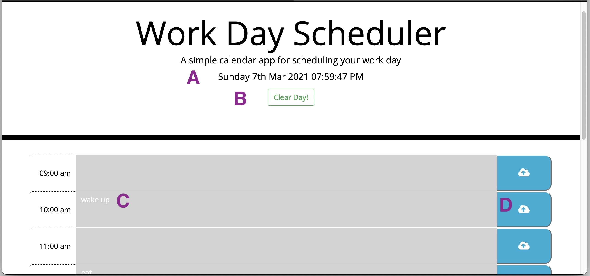
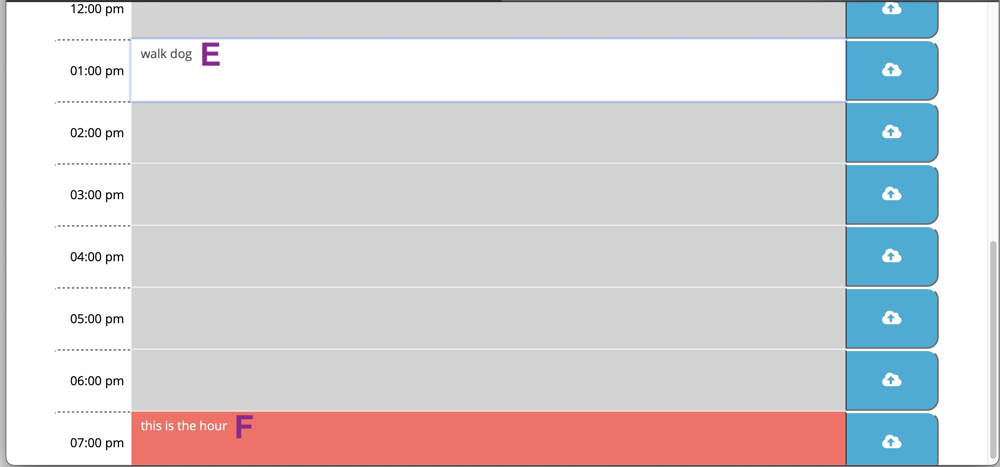
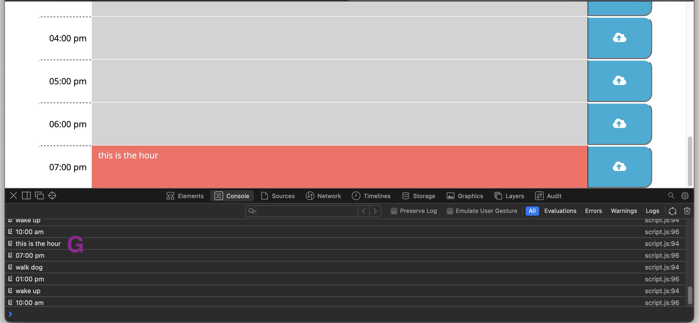

# dayPlanner

A. Current date, time, month and year.

B. The "Clear Day!" button will erase all the entries to the time slots. 

C. Every hour has a div box where the user can input their task for the day. 

D. After user inputs task they can save to local storage.

E. The div box will turn white when the user is inputting their values. 

F. The current hour will display in red. 

G. Everything the user saves will be stored to local storage. This will allow for everything the user saves into the div box to be there after they reload the page. 

--------------------------------------------------------------------------------------------------------------------------

My Git hub profile : https://github.com/javiistacks

Git Hub repository: https://github.com/javiistacks/dayPlanner

Finished Product: https://javiistacks.github.io/dayPlanner/
